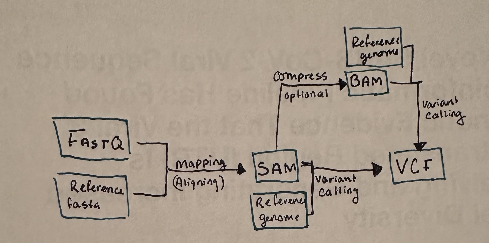

# Genomics Pipeline Introduction Worksheet

<!--- Write name below --->
## Name: Baylee Christensen

<!--- For this worksheet, answer the following questions --->

## Q1: What is a bioinformatics pipeline?
Answer: Bioinformatics algorithms executed in a predefined sequence to process
large sets of data, progressively shepherding and processing massive sequence
data and their associated metadata through a series of transformations using
software components, databases, and operation environments.

## Q2: What are the three basic filetypes discussed in this repository? What information do they contain?
Answer: There are fastq files which are considered raw read files. They
contain sequence identifier information, a header, and a quality score for each position.
There are also SAM files, which stand for sequence alignment maps, in which
the sequence identifiers are compared to a reference genome. SAM files contain a
header section, an alignment section, and mapping details. Then
there are VCF files, which stand for variant call format files. The VCF file is a lot
smaller than the SAM file, and they contain information regarding the positions
that are different from the reference genome, called sequence variants.

## Q2: What does a general bioinformatics pipeline look like? Draw a schematic of a pipeline (using boxes and arrows) and add the image file name to the <insert-file-name-here> text below (png or jpg will work). Your schematic should include file types, program types (e.g., mapping program), and arrows between file types.

## Q3: Using information from the genomics-pipeline-intro.sh script and [Farkas et al., 2021](https://doi.org/10.3389/fmicb.2021.665041), draw another schematic specific to their study showing file types, program types (use specific program names in this schematic), and arrows between file types. Add the image file name to the <insert-file-name-here> text below.

## Q4: After running the genomics-pipeline-intro.sh script, how many variants are in merged.vcf?
Answer: 1597

## Q5: What is the alternate allele depth of sample SRR11621811|unknown at site 25350 in contig NC_045512.2?
Answer: 798

## Q6: In what ways would you consider filtering the VCF? In other words, what criteria would you use to remove variants / genotypes from the dataset?
Answer: There are multiple ways to filter a VCF, and the parameters chosen usually align with
the goals of your study. I believe that quality score would be an important
threshold for most, where filtering out low quality scores would be particularly
important for an accurate representation of the variants. With that in mind, it's important to consider depth of coverage, as this gives insight as to how confident that particular sequence
is by understanding how many reads show an exact nucleotide on the target
sequence. Also, I believe that considering mapping quality would have a great impact on removing
unreliable calls, as variants with a lower mapping quality could indicate
misalignment.
